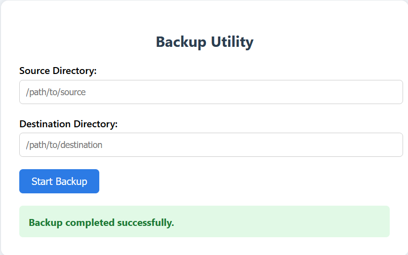

# 📁 Backup Utility

A simple Python-based backup tool that offers both a **web interface** (via Flask) and a **command-line interface (CLI)** to copy files from a source directory to a destination directory. Files are uniquely named using timestamps to prevent overwriting.

---

## 🔧 Features

- 🖥️ Web UI for user-friendly backup initiation
- 💻 Command-line interface for quick terminal usage
- 🕒 Automatically appends timestamps to avoid filename collisions
- ⚠️ Validates paths and file presence before backup
- 📐 Clean and responsive HTML interface

---

## 📁 Project Structure

Backup_Files/ 
        ├── app.py # Flask web application 
        ├── backup.py # Command-line backup script 
        ├── templates/ 
        │ └── index.html # Web interface HTML template 
        └── README.md # Project documentation

---

## 📦 Requirements

- Python 3.12 or higher
- pip (Python package installer)

## How to install

git clone https://github.com/sainathislavath/Backup_Files.git
cd Backup_Files


## Install required packages:

```bash
pip install flask

### Run the application

python app.py

### Open in Browser

http://127.0.0.1:5000/

